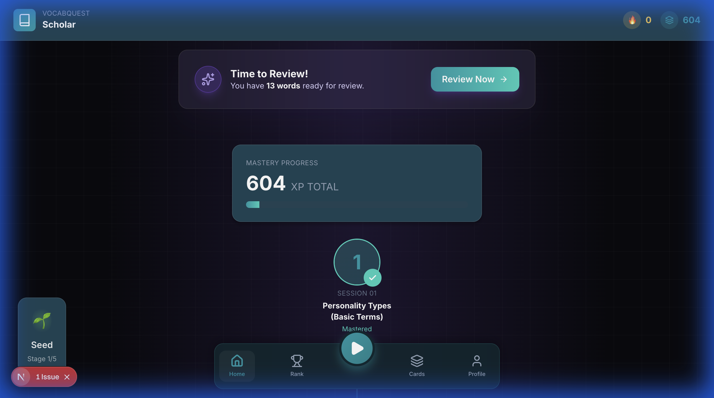
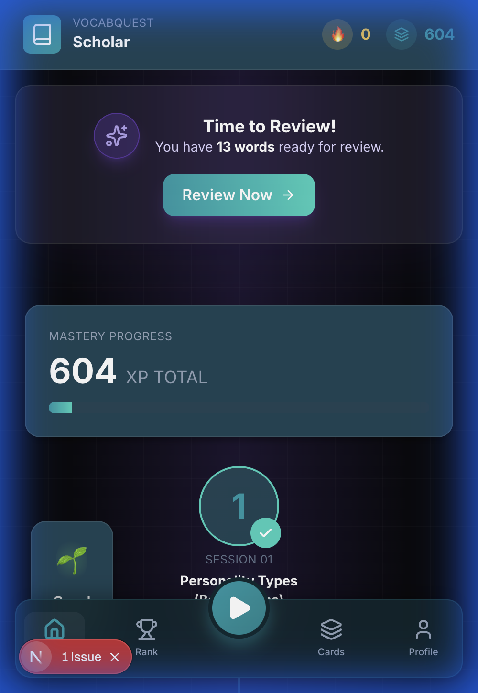
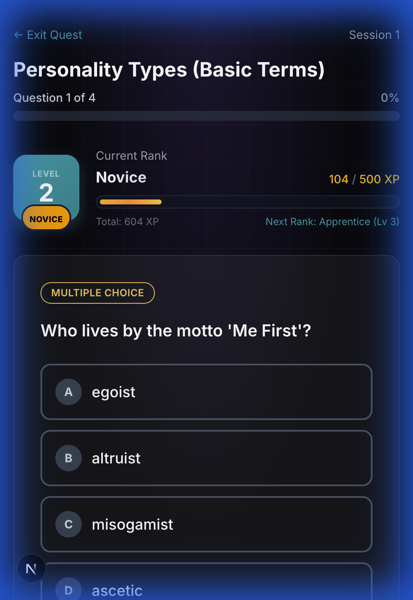

# VocabQuest - Gamified Vocabulary Learning

A gamified vocabulary learning app with daily streaks, character evolution, and spaced repetition. Built with Next.js and Supabase.


## 📸 Screenshots

<div align="center">
  
</div>

<div align="center" style="display: flex; gap: 10px; justify-content: center; margin-top: 10px;">
  
  
</div>

## ✨ Features

- 🎮 **Gamified Quests**: Learn vocabulary through interactive sessions with XP and leveling
- 🔥 **Daily Streaks**: Build consistency with Duolingo-style daily streak tracking
- 🌱 **Character Evolution**: Watch your character grow from Seed to Blossom as you maintain streaks
- 🧠 **SM-2 Spaced Repetition**: Scientifically-proven algorithm schedules reviews at optimal intervals
- 📖 **Etymology & Roots**: Learn word origins and root meanings for deeper understanding
- 👤 **Anonymous Auth**: No login required - progress saved automatically
- 📊 **Rank System**: Progress through ranks from Novice to Word Master

## 🚀 Tech Stack

- **Frontend**: Next.js 15 (App Router), TypeScript, TailwindCSS
- **Backend**: Supabase (PostgreSQL, Auth, RLS)
- **Algorithm**: SM-2 Spaced Repetition
- **Monitoring**: Structured logging for production

## 📋 Getting Started

### Prerequisites

- Node.js 18+
- npm or yarn
- A Supabase project ([create one free](https://supabase.com))

### 1. Clone and Install

```bash
cd wpmeg
npm install
```

### 2. Set Up Supabase

1. Create a new project at [supabase.com](https://supabase.com)
2. Go to **SQL Editor** and run migrations:
   - Copy contents of `supabase/migrations/001_initial_schema.sql`
   - Copy contents of `supabase/migrations/002_streak_system.sql`
   - Paste and run each in SQL Editor
3. Go to **Authentication → Providers** and enable **Anonymous Sign-in**
4. Copy your project credentials from **Settings → API**

### 3. Configure Environment

```bash
cp .env.example .env.local
```

Edit `.env.local`:
```env
NEXT_PUBLIC_SUPABASE_URL=https://your-project.supabase.co
NEXT_PUBLIC_SUPABASE_ANON_KEY=your-anon-key
```

### 4. Run Development Server

```bash
npm run dev
```

Open [http://localhost:3000](http://localhost:3000)

### 5. Import Content

1. Navigate to [http://localhost:3000/admin/import](http://localhost:3000/admin/import)
2. Enter the import secret (set in your env)
3. Click "Import Content"

## 🎯 Usage Flow

1. **Start**: Click "Start Learning" on the landing page
2. **Dashboard**: View your XP, level, streaks, and character evolution
3. **Quest**: Play a session to learn new vocabulary
4. **Review**: Answer flashcards using Again/Hard/Good/Easy buttons
5. **Progress**: Watch your XP grow, maintain streaks, and evolve your character!

## 📁 Project Structure

```
wpmeg/
├── content/wpmae/           # Vocabulary content (JSON)
├── supabase/migrations/     # Database schema & migrations
├── src/
│   ├── app/                 # Next.js pages & API routes
│   │   ├── home/           # Dashboard with stats, streaks
│   │   ├── quest/          # Learning sessions
│   │   ├── review/         # Spaced repetition review
│   │   └── actions/        # Server actions (DB logic)
│   ├── lib/
│   │   ├── sm2.ts          # SM-2 algorithm
│   │   ├── streak.ts       # Streak utilities
│   │   ├── logger.ts       # Production logging
│   │   └── types.ts        # TypeScript types
│   └── components/         # React components
│       ├── game/           # XP, Streaks, Character
│       └── ui/             # Buttons, Cards, etc.
```

## 🎓 SM-2 Algorithm

- **Again** (quality 2): Reset - review tomorrow
- **Hard** (quality 3): Correct with difficulty
- **Good** (quality 4): Correct answer
- **Easy** (quality 5): Perfect recall

Interval increases exponentially with correct answers.

## 🏆 XP & Leveling

- +10 XP for correct answers
- +2 XP for incorrect answers
- +50 XP for completing a session
- Level = floor(XP / 500) + 1
- Ranks: Novice → Apprentice → Scholar → Expert → Master → Word Master

## 🔥 Daily Streaks

- 1 session OR 5 reviews = 1 day activity
- Streak milestones unlock character evolution:
  - 3 days: Sprout 🌱
  - 7 days: Seedling 🌿
  - 14 days: Growing 🪴
  - 30 days: Blossom 🌸

## 🔍 Production Monitoring

Logs are automatically captured for critical operations:
- User authentication flows
- XP updates
- Session completions
- Review submissions
- Streak updates

**Where to check logs:**
- **Development**: Browser console + terminal running `npm run dev`
- **Production (Vercel)**: Dashboard → Project → Logs tab → Filter by "Error"

## 🗄️ Database Schema

- **books**: Book metadata
- **chapters**: Chapter groupings
- **sessions**: Learning sessions
- **words**: Vocabulary with etymology
- **exercise_items**: Quiz prompts
- **user_profile**: XP, level, streaks, character stage
- **user_session_progress**: Session completion tracking
- **user_word_state**: SM-2 state per word
- **user_daily_activity**: Daily streak tracking

## 🚢 Deployment

### Deploy to Vercel

1. Push code to GitHub
2. Import project in [Vercel](https://vercel.com)
3. Add environment variables:
   - `NEXT_PUBLIC_SUPABASE_URL`
   - `NEXT_PUBLIC_SUPABASE_ANON_KEY`
4. Deploy!

**Post-deployment:**
- Check logs in Vercel Dashboard → Logs
- Monitor error rates
- Test complete user flow (signup → quest → review → streak)

## 📝 License

MIT
